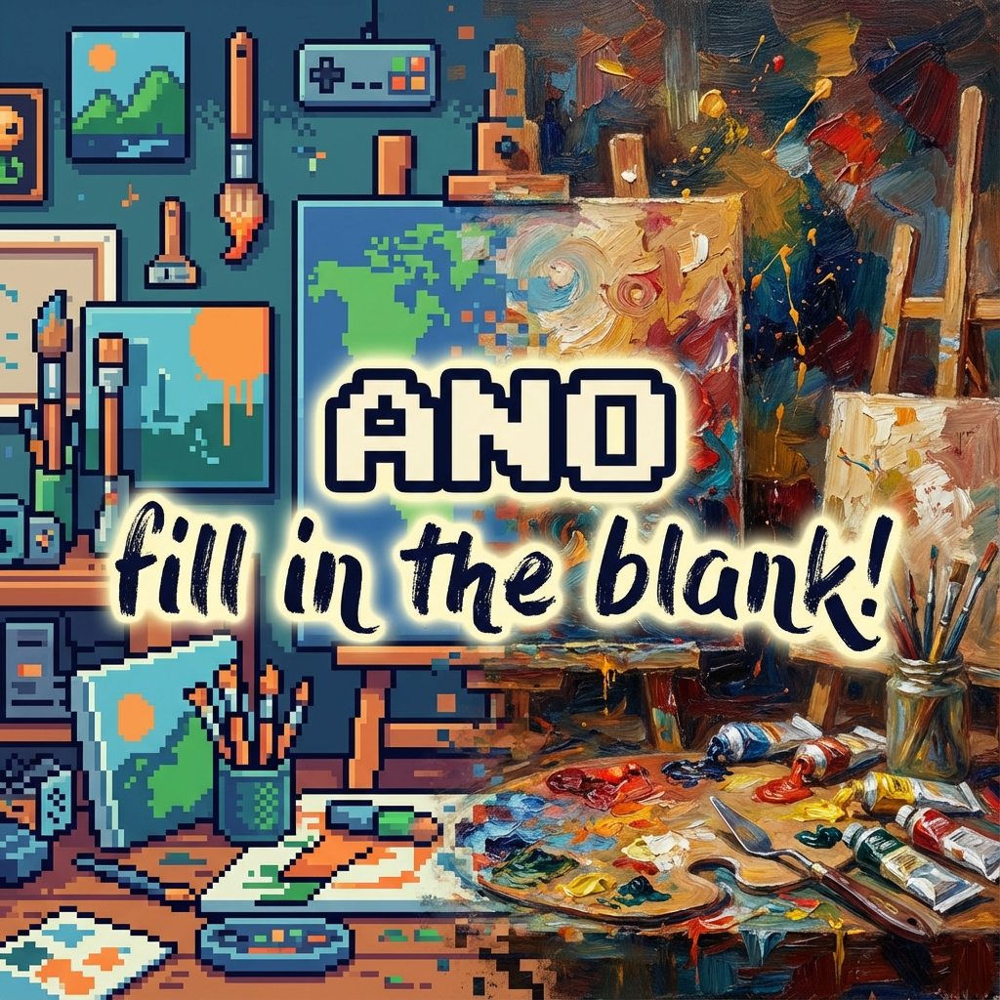

# ANO: The Party Drawing Game 🎨

Visit the full game at anogame.xyz

**ANO** is a real-time, mobile-first party drawing game where players annotate
images and vote for the best additions. Built for the moment you miss your
friends but don't have time for a 30-minute commitment.

## 🚀 The Vibe: "Laughter Per Minute"

We built **ANO** because we missed our friends but are too busy for long game
sessions. No accounts. No friction. Just instant shared laughter.

It's **Mobile-First Chaos**. The UI mimics a premium **native iOS
application**—fluid gestures, glassmorphism, and haptic feedback—delivered
instantly via the web.

## ✨ Features

- **Zero-Friction Entry**: Click a link, joined in 5 seconds. No sign-up, no
  install.
- **Async-Friendly**: Play a full round in 5 minutes, or leave it running all
  day for "play when you can" moments.
- **The Saboteur**: One player is secretly trying to ruin the drawing. The "WTF"
  conversations in your group chat will be legendary.
- **Viral Souvenirs**: Every match ends with a beautiful, shareable image of the
  group's "masterpiece."
- **iOS Native Feel**: 60fps animations, spring physics, and intuitive gestures
  (pinch-to-zoom, swipe-to-dismiss).

## 🎮 How to Play

1. **Start a Party**: One person hosts and shares the 4-letter code (or QR
   code).
2. **Join In**: Everyone else joins on their phones. Pick a nickname and a
   color.
3. **The Subject**: The game picks an "Uploader" to choose a photo or take a
   fresh one.
4. **Draw!**: Everyone gets 30 seconds to add their masterpiece to the image.
5. **Vote**: Pick your favorite addition. You can't vote for yourself!
6. **Win**: Earn points, level up, and unlock new badges.

## 🛠️ Tech Stack

- **Frontend**: React 19, TypeScript, Hex Engine (Custom Canvas)
- **Styling**: Tailwind CSS, Framer Motion
- **Backend**: Firebase Realtime Database (Serverless)

### Technical Highlights

- **Resolution Independence**: All drawings use a percentage-based coordinate
  system (0-100%), ensuring your masterpiece looks the same on an iPhone and a
  desktop.
- **State Machine Architecture**: The game logic is driven by a strict state
  machine, ensuring all 10+ players stay perfectly in sync through every phase
  of the game.

---

_Built with ❤️ by Curren_
